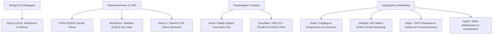
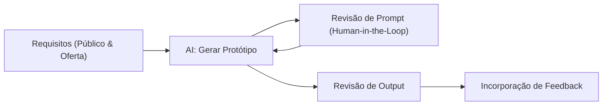
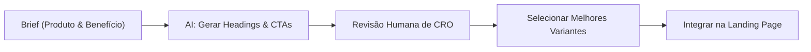
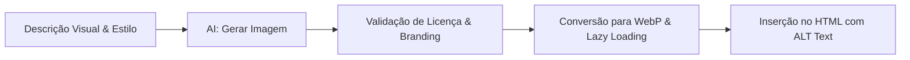
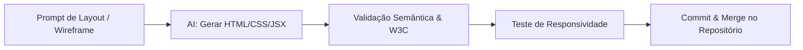
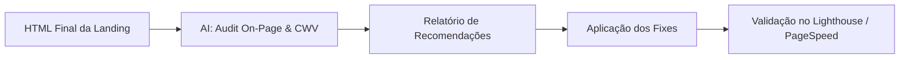
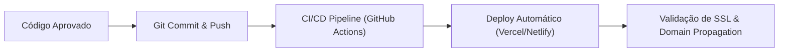
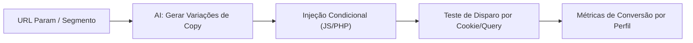
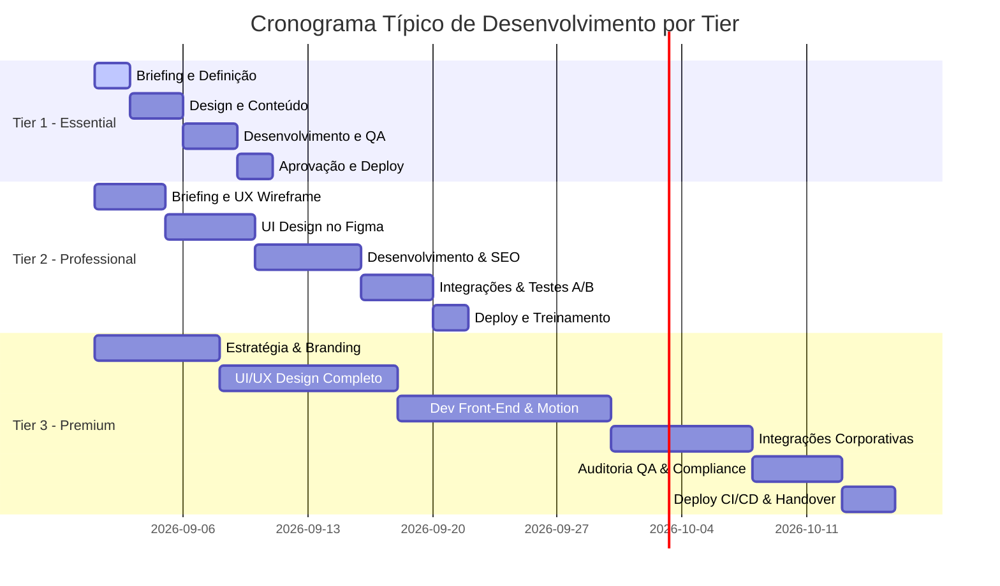

# 06 — Guia Comercial e Operacional de Landing Pages
## Síntese Consolidada de Plataformas, Preços 2026, Compliance Legal, Agentes IA e QA

Versão 1.0 — 2026-08

---

## 1. Tabela Comparativa de Plataformas e Stacks

A escolha da tecnologia define o equilíbrio entre facilidade de manutenção, flexibilidade, custo operacional e performance (TTFB / Core Web Vitals).

| Tecnologia / Plataforma | Vantagens | Desvantagens | Custo Aproximado | Flexibilidade & Uso Ideal |
|---|---|---|---|---|
| **WordPress + Elementor** | Ecossistema aberto (60.000+ plugins); SEO avançado (Yoast/RankMath); curva de aprendizado baixa para edição. | Requer hospedagem própria, manutenção constante de segurança e plugins; desempenho pode degradar sem otimização rigorosa. | Elementor Pro ~US$ 60/ano + Hospedagem (US$ 50–250/ano). | Flexibilidade alta. Ideal para PMEs e projetos que exigem gestão de conteúdo independente. |
| **HTML / CSS / JS Estático** | Máxima velocidade e segurança (sem banco de dados ou CMS vulnerável); zero mensalidade de builders; hospedagem gratuita/econômica. | Edição exige desenvolvedor; integrações demandam código manual; sem painel administrativo padrão. | Custo de desenvolvimento por página (ex.: R$ 1.000 — R$ 3.000). | Flexibilidade total no código. Ideal para Tier 1 (Essential) e landing pages de alta conversão. |
| **Webflow** | Builder visual profissional; hospedagem CDN global inclusa (AWS/Cloudflare); excelente performance *out-of-the-box* (TTFB < 100ms); exportação de código. | Mensalidade em dólar; limite de itens CMS e formulários nos planos básicos; curva de aprendizado de CSS. | Plano CMS US$ 276/ano; Business US$ 468/ano (planos mensais a partir de US$ 29/mês). | Flexibilidade média-alta. Ideal para agências e marcas que exigem prototipagem visual avançada. |
| **Unbounce** | Focado 100% em conversão; Smart Traffic (IA); testes A/B nativos; formulários multi-etapa e popups otimizados. | Preço elevado; limites de tráfego (visitas/mês); não inclui heatmaps nativos (exige Hotjar externo). | Build US$ 99/mês; Experiment US$ 149/mês; Optimize US$ 249/mês. | Flexibilidade focada em CRO. Ideal para campanhas de mídia paga de alto volume. |
| **Leadpages** | Construtor ágil; popups e alertas integrados; testes A/B no plano Grow; Leadpages Optimize inclui heatmaps integrados. | Menos recursos de personalização de layout comparado a Webflow; sem recursos de IA avançados. | Standard US$ 49/mês; Grow US$ 99/mês; Advanced US$ 199/mês. | Flexibilidade média. Ideal para infoprodutores e pequenas empresas com foco direto em leads. |
| **Next.js + Tailwind + Vercel (Stack Moderno)** | Performance extrema (SSG/SSR); pontuação Lighthouse 100; CI/CD automatizado via Git; segurança total; totalmente escalável. | Requer conhecimentos avançados de React/Next.js; sem CMS visual nativo (necessita Headless CMS se cliente for editar). | Hospedagem grátis (Vercel Hobby) ou US$ 20/mês (Vercel Pro) + desenvolvimento. | Flexibilidade absoluta. Ideal para Tier 3 (Premium), SaaS, startups e projetos de grande escala. |

---

## 2. Precificação Atualizada 2026 e Retainers de Manutenção

Valores consolidados alinhados às práticas de mercado brasileiras atualizadas para 2026, integrando a matriz comercial do ecossistema.

### 📊 Tabela de Preços e Prazos por Tier (Valores 2026)

| Item / Métrica | Tier 1 — Essential | Tier 2 — Professional | Tier 3 — Premium |
|---|---|---|---|
| **Faixa de Investimento (BRL)** | **R$ 1.000 — R$ 3.000** | **R$ 3.000 — R$ 6.000** | **R$ 6.000 — R$ 12.000+** |
| **Prazo de Entrega Estimado** | 5 a 10 dias úteis | 2 a 3 semanas | 4 a 6 semanas (ou mais) |
| **Público-Alvo Ideal** | Pequenas empresas, startups, lançamentos pontuais (e-book, webinar), MVPs. | PMEs, agências, projetos recorrentes com funis de venda definidos. | Grandes corporações, SaaS, e-commerce, setores regulados e marcas de luxo. |
| **Garantia / Suporte Pós-Entrega** | 1 mês de ajustes leves (resposta em até 72h). | 3 meses de suporte por e-mail/chat (resposta em até 24h). | 6 a 12 meses de manutenção inclusa, contato direto e chamados prioritários. |
| **SLA de Uptime Hospedagem** | Suporte standard do host contratado. | 99,9% uptime via serviços gerenciados. | 99,99% uptime com monitoramento 24/7 e alertas. |

### 🛠️ Retainers de Manutenção Mensal (Opcional)

Oferecer manutenção recorrente garante previsibilidade financeira para o prestador e segurança operacional para o cliente:

- **Manutenção Essential (~R$ 400 / mês)**:
  - Pequenas alterações de texto/imagem (até 2h/mês)
  - Monitoramento básico de links e formulários
  - Verificação mensal de SSL e status de hospedagem
- **Manutenção Professional (R$ 600 — R$ 800 / mês)**:
  - Atualizações de conteúdo, banners e ofertas (até 5h/mês)
  - Backups programados mensais e patches de segurança no CMS
  - Relatório mensal simples de acessos e conversões (GA4)
- **Retainer Premium (R$ 1.000+ / mês)**:
  - Monitoramento 24/7 de uptime e segurança (WAF / anti-DDoS)
  - Otimização contínua de velocidade (Core Web Vitals) e SEO On-Page
  - Testes A/B iterativos e ajustes de CRO baseados em heatmaps
  - Relatórios analíticos customizados e implementação de novas seções/features

---

## 3. Stack Tecnológico & Ecossistema de Ferramentas

Para entregas de alto nível, o ecossistema Antigravity utiliza uma suíte de ferramentas líderes de mercado, permitindo modularidade conforme a necessidade do projeto:



### Detalhamento das Ferramentas Recomendadas:
1. **Figma**: Padronização visual com *design tokens* (cores, tipografias, espaçamentos). Essencial para envio e aprovação no Tier 2 e Tier 3 antes da codificação.
2. **Next.js + Tailwind CSS**: Stack moderno para o Tier 3. O uso de SSR/SSG garante carregamento pré-renderizado ultrarrápido, otimizando o LCP (*Largest Contentful Paint*) e a pontuação do Google Lighthouse.
3. **Vercel / Netlify**: Plataformas de deploy contínuo conectadas ao GitHub. Oferecem SSL/TLS automatizado, ambientes de preview e distribuição via CDN edge mundial.
4. **Stripe**: Solução padrão para checkout e pagamentos diretos na landing page, oferecendo SDKs flexíveis e suporte a pagamentos recorrentes ou pontuais.
5. **Hotjar / VWO**: Ferramentas de *behavior analytics* (heatmaps de clique/scroll e gravações de sessão) para embasar testes de CRO nos pacotes Professional e Premium.
6. **Zapier / Make**: Conectores para criar automações entre o formulário da landing page e múltiplos sistemas (ex: enviar lead para CRM + disparar mensagem no Slack/WhatsApp simultaneamente).

---

## 4. Agentes de IA & Pipelines de Automação (Antigravity IDE)

No ambiente Antigravity IDE, agentes de IA atuam como copilotos de desenvolvimento em cada etapa do ciclo de vida da landing page.

### 4.1 Engenharia de Prompts
Capacidade de estruturar prompts ricos com especificações de público-alvo, oferta, restrições e tom de voz para acelerar a fase de briefing e prototipagem.



### 4.2 Copywriting Persuasivo com IA
Geração automatizada de headlines, sub-headlines, bullet points de benefícios e chamadas para ação (CTAs).


*Prompt de Exemplo*:
> *"Atue como especialista em copywriting de conversão. Crie 3 opções de headlines com no máximo 10 palavras para um serviço de fotografia fine art para casamentos de luxo. Enfatize a exclusividade e a eternização de momentos. Tom elegante e persuasivo."*

### 4.3 Geração e Otimização de Mídia (DALL-E / Midjourney)
Criação de imagens de hero, ilustrações conceituais ou elementos gráficos sem problemas de direitos autorais.


### 4.4 Construção de Layout Front-End
Geração de código HTML/CSS semântico ou componentes React/Tailwind diretamente a partir de especificações de design.


### 4.5 Auditoria de SEO e Performance via IA
Análise automatizada da estrutura HTML gerada para identificar lacunas de marcação semântica, meta tags ausentes ou imagens sem atributo `alt`.


### 4.6 DevOps, CI/CD e Deploy Automatizado
Automação do fluxo de publicação via repositório Git integrado a plataformas de hospedagem JAMstack.


### 4.7 Personalização Dinâmica de Conteúdo
Alteração dinâmica de elementos da página (como headlines ou depoimentos) com base na origem do tráfego ou parâmetros da URL (`UTM_campaign`, `UTM_source`).


---

## 5. Compliance Legal, LGPD e Contratos

A conformidade legal protege a reputação do cliente e evita penalidades regulatórias decorrentes do tratamento inadequado de dados pessoais (Lei 13.709/2018 — LGPD).

### 🛡️ Requisitos Obrigatórios de LGPD e Privacidade
1. **Consentimento Explícito**:
   - Checkbox de consentimento **não pré-marcado** nos formulários de captura.
   - Exemplo de texto legal: *"Eu concordo em fornecer meus dados para receber o contato e comunicações sobre [Nome da Oferta]."*
2. **Política de Privacidade Acessível**:
   - Link visível para a Política de Privacidade localizado imediatamente abaixo do formulário de captura e também no rodapé.
3. **Banner de Consentimento de Cookies**:
   - Mecanismo para permitir a aceitação ou recusa de cookies não essenciais (pixels de rastreamento, Google Analytics).
4. **Segurança de Tráfego**:
   - Certificado SSL/TLS obrigatório (HTTPS ativo em todas as URLs). Transmissão criptografada de formulários.

### 📝 Cláusulas Essenciais para o Contrato de Serviços
- **Escopo e Entregáveis**: Discriminação exata do pacote (Essential, Professional ou Premium), número de seções, integrações inclusas e o que é considerado *fora do escopo* (ex.: criação de logo, gestão de tráfego pago).
- **Prazos e Condições de Pagamento**: Cronograma detalhado com marcos de entrega (ex: 50% de sinal e 50% na aprovação do deploy). Previsão de taxa para mudanças de escopo (*change request*).
- **Propriedade Intelectual**: O cliente detém os direitos sobre os conteúdos finais entregues após a quitação integral; o prestador retém os direitos de uso de seus componentes base, bibliotecas e métodos proprietários.
- **Confidencialidade**: Proteção de dados estratégicos, listas de clientes e volumes de conversão trocados durante a execução do projeto.
- **Garantia e Suporte**: Período claro de garantia para correção de bugs sem custo adicional e definição dos valores de suporte avulso/mensal pós-garantia.
- **Responsabilidade LGPD**: Definição clara de que o prestador atua como *operador* na estruturação técnica da página, cabendo ao cliente a responsabilidade final como *controlador* dos dados coletados.

---

## 6. Acessibilidade Digital (WCAG & Normas Brasileiras)

Garantir acessibilidade digital atende ao princípio de inclusão social e cumpre exigências legais vigentes no Brasil, além de melhorar o SEO e a navegação em dispositivos móveis.

### ⚖️ Amparo Legal e Técnico no Brasil
- **Lei Brasileira de Inclusão da Pessoa com Deficiência (Lei nº 13.146/2015 — Art. 63)**: Torna obrigatória a acessibilidade nos sítios da internet mantidos por empresas com sede ou representação comercial no país.
- **ABNT NBR 17060:2022**: Especifica requisitos de acessibilidade para aplicações web.
- **ABNT NBR 17225:2025**: Atualização que incorpora diretrizes internacionais para ambientes digitais responsivos.

### ♿ Diretrizes Práticas WCAG 2.1 / 2.2 Aplicadas

| Elemento | Requisito WCAG | Implementação Prática |
|---|---|---|
| **Semântica HTML** | Nível A | Uso correto de tags `<header>`, `<main>`, `<section>`, `<nav>`, `<footer>` e elementos de formulário `<label>`, `<button>`. |
| **Navegação por Teclado** | Nível A | Todos os elementos interativos (links, botões, inputs) devem receber foco visível e ser acionáveis via tecla `TAB` e `ENTER`/`Espaço`. |
| **Contraste de Cores** | Nível AA | Razão de contraste mínima de **4.5:1** para texto normal e **3:1** para texto grande. No Tier 3 (Premium), buscar razões de 7:1. |
| **Textos Alternativos** | Nível A | Atributo `alt` obrigatório em imagens informativas. Imagens puramente decorativas devem conter `alt=""` ou `aria-hidden="true"`. |
| **Formulários Acessíveis** | Nível A / AA | Relação explícita entre `<label for="id">` e `<input id="id">`. Mensagens de erro claras e legíveis por leitores de tela via `aria-live` ou `aria-describedby`. |
| **Conteúdo Multimídia** | Nível AA | Vídeos incorporados devem possuir legendas ativas ou transcrição textual disponível. |

---

## 7. Fluxos de Integração e Cronograma Gantt

### 🔄 Diagrama ER de Integrações da Landing Page

```mermaid
erdiagram
    LANDINGPAGE ||--|{ FORM : "contem"
    LANDINGPAGE ||--|{ ANALYTICS : "registra eventos"
    LANDINGPAGE ||--|{ PIXEL : "dispara conversoes"
    FORM }|--|| SPAMFILTER : "validado por (reCAPTCHA/Honeypot)"
    FORM }|--|| CRM : "envia leads para"
    FORM }|--|| EMAILTOOL : "dispara automacao em"
    LANDINGPAGE ||--o| PAYMENTGATEWAY : "redireciona checkout"
```

### 📅 Cronograma de Projeto (Gantt)



---

## 8. Checklists de Quality Assurance (QA) por Tier

Checklists rigorosos previnem erros em produção e garantem a entrega de uma página de alta performance.

### 📋 Checklist QA — Tier 1 (Essential)
- [ ] Responsividade verificada em resoluções mobile (360px, 375px, 414px) e desktop (1366px, 1920px).
- [ ] Formulário de contato testado (envio de dados verificado e recebido com sucesso).
- [ ] Proteção anti-spam ativa (honeypot ou reCAPTCHA v3 funcional).
- [ ] Links externos com `target="_blank"` e `rel="noopener noreferrer"`.
- [ ] Certificado SSL ativo (redirecionamento HTTP -> HTTPS funcionando).
- [ ] Meta title, meta description e favicon configurados corretamente.
- [ ] Performance básica validada (Google PageSpeed Mobile > 70).
- [ ] Banner simples de cookies / aviso de privacidade ativo.

### 📋 Checklist QA — Tier 2 (Professional)
- [ ] Todos os itens do Checklist Tier 1 validados.
- [ ] Validação avançada de formulário (máscara de telefone, validação estrita de e-mail).
- [ ] Integração com CRM / ferramenta de e-mail marketing testada (leads caindo na lista correta).
- [ ] Google Analytics (GA4) e Google Tag Manager (GTM) disparando eventos de conversão.
- [ ] Pixels de conversão (Meta/Facebook, Google Ads) validados via extensões de auditoria (Pixel Helper).
- [ ] SEO On-Page avançado (headings semânticos `<h1>`-`<h6>`, OpenGraph para compartilhamento WhatsApp/Social).
- [ ] Verificação de acessibilidade básica (contraste de texto ≥ 4.5:1, navegação via teclado `TAB`).
- [ ] Pontuação Google Lighthouse ≥ 80 em Performance e SEO em ambos os dispositivos.
- [ ] Variantes para Teste A/B estruturadas e prontas para rodar.

### 📋 Checklist QA — Tier 3 (Premium)
- [ ] Todos os itens do Checklist Tier 2 validados.
- [ ] Pipeline CI/CD ativo com automação de build e deploy sem parada (*zero downtime*).
- [ ] Testes de segurança básica no front-end (sanitização de inputs contra XSS e CSRF).
- [ ] Conformidade total de acessibilidade WCAG 2.2 AA (leitores de tela NVDA/TalkBack testados, foco visível customizado).
- [ ] Otimização extrema de performance (Core Web Vitals: LCP < 1.2s, CLS < 0.05, FID/INP < 100ms, PageSpeed Mobile ≥ 90).
- [ ] Schema.org (JSON-LD) validado na ferramenta de Teste de Resultados Ricos do Google.
- [ ] Testes de falha e desconexão de API (tratamento gracioso de erros com mensagens amigáveis ao usuário).
- [ ] Relatórios analíticos customizados pré-configurados no Looker Studio / GA4.
- [ ] Documentação técnica completa e manual de gestão entregues ao cliente.

---

*Antigravity Dev Standards — 06-Guia-Comercial-Landing-Pages v1.0 | 2026-08*
